# Exploratory Data Analysis Report: Task 1 (Cars) and Task 2 (Crop Yield)

All numbers in this report were produced by `EDA_Task1_Task2.R`. The full console output is in `EDA_Output.txt` and every figure is in the `plots` folder.

Each dataset is examined in four layers: data quality, one variable at a time, two variables at a time, and three variables together. Each layer ends with an interpretation, and each dataset ends with actionable insights.

---

# Part 1: Task 1, the cars dataset

## 1.1 What the data is

32 cars from a 1974 motoring magazine, one row per car, 11 numeric measurements. The variable of interest is fuel economy, `mpg` (miles per gallon).

| Variable | Meaning | Type in practice |
|---|---|---|
| mpg | Miles per US gallon | Continuous (outcome) |
| cyl | Number of cylinders (4, 6, 8) | Categorical |
| disp | Engine displacement, cubic inches | Continuous |
| hp | Gross horsepower | Continuous |
| drat | Rear axle ratio | Continuous |
| wt | Weight, 1000 lbs | Continuous |
| qsec | Quarter-mile time, seconds | Continuous |
| vs | Engine shape: 0 = V, 1 = straight | Categorical |
| am | Transmission: 0 = automatic, 1 = manual | Categorical |
| gear | Forward gears (3, 4, 5) | Categorical |
| carb | Carburettors (1 to 8) | Categorical |

## 1.2 Data quality

- 32 rows, 12 columns, **no missing values**, **no duplicate rows**, no duplicate car names.
- All 11 measurements are stored as numbers, but five of them have only 2 to 6 distinct values (cyl, vs, am, gear, carb). They are categories in disguise and must be treated as factors in any model.
- Sample size is small. With 32 cars, every result below carries wide uncertainty, and a single unusual car can move a mean.

**Interpretation.** The file is clean and needs no imputation. The only preparation is converting the five discrete columns to factors.

## 1.3 One variable at a time

### Continuous variables

| Variable | Mean | SD | Min | Median | Max | Skew | CV % |
|---|---|---|---|---|---|---|---|
| mpg | 20.09 | 6.03 | 10.4 | 19.2 | 33.9 | 0.61 | 30.0 |
| disp | 230.72 | 123.94 | 71.1 | 196.3 | 472.0 | 0.38 | 53.7 |
| hp | 146.69 | 68.56 | 52 | 123 | 335 | 0.73 | 46.7 |
| drat | 3.60 | 0.53 | 2.76 | 3.70 | 4.93 | 0.27 | 14.9 |
| wt | 3.22 | 0.98 | 1.51 | 3.33 | 5.42 | 0.42 | 30.4 |
| qsec | 17.85 | 1.79 | 14.5 | 17.7 | 22.9 | 0.37 | 10.0 |

CV is the coefficient of variation, the standard deviation as a percentage of the mean.

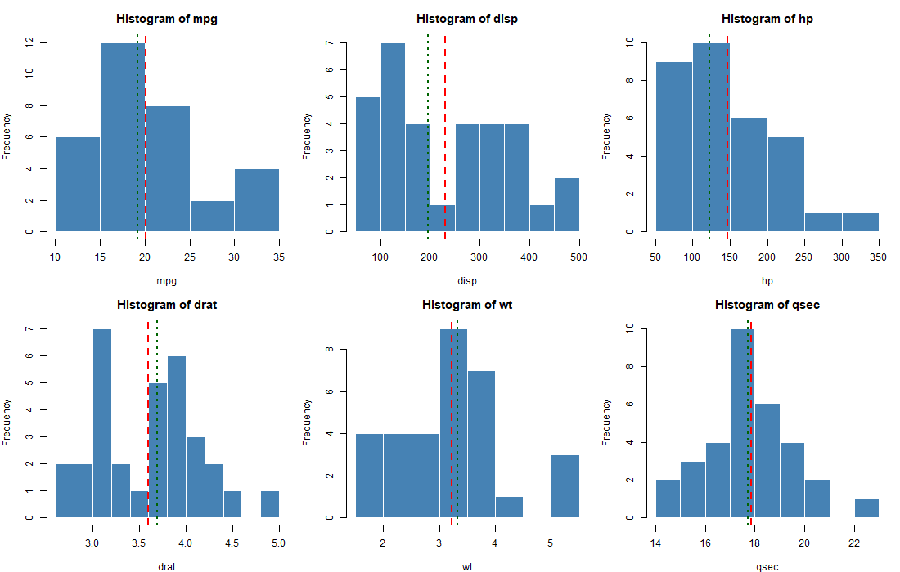

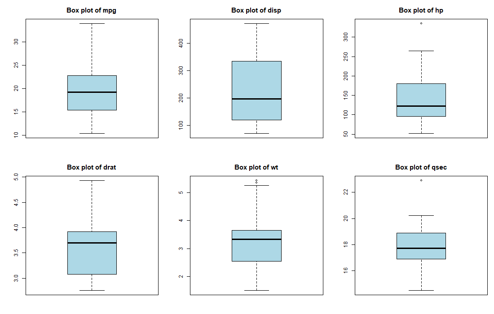

**Outliers by the 1.5 × IQR rule**

| Variable | Outlier car(s) |
|---|---|
| mpg | Toyota Corolla (33.9) |
| hp | Maserati Bora (335) |
| wt | Cadillac Fleetwood (5.25), Lincoln Continental (5.42), Chrysler Imperial (5.35) |
| qsec | Merc 230 (22.9) |

**Interpretation.**
- mpg is **right-skewed** (skew 0.61). The bulk of cars sit between 15 and 23 mpg and a small tail of light 4-cylinder cars reaches above 30. The mean (20.1) is pulled above the median (19.2).
- hp and disp are the most **dispersed** variables (CV 47 % and 54 %) and both are right-skewed. The market in this sample ranges from 52 hp economy cars to a 335 hp Maserati, and that one car is a statistical outlier.
- wt has three heavy outliers, all large American luxury saloons above 5,000 lbs. They sit at the bottom of the mpg range too.
- qsec is the **most stable** variable (CV 10 %). Almost all cars cover the quarter mile in 15 to 20 seconds.
- None of the outliers are data errors. They are real, extreme cars and should be kept, but any model must be checked for whether these few cars drive the result.

### Categorical variables

| Variable | Level counts (percent) |
|---|---|
| cyl | 4: 11 (34 %), 6: 7 (22 %), 8: 14 (44 %) |
| vs | V-shaped: 18 (56 %), straight: 14 (44 %) |
| am | automatic: 19 (59 %), manual: 13 (41 %) |
| gear | 3: 15 (47 %), 4: 12 (38 %), 5: 5 (16 %) |
| carb | 1: 7, 2: 10, 3: 3, 4: 10, 6: 1, 8: 1 |

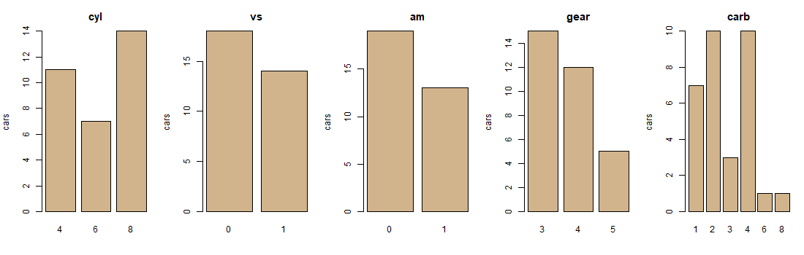

**Interpretation.** 8-cylinder cars are the largest group, and 6-cylinder the smallest. Two carburettor levels (6 and 8) have a single car each, so any per-level statistic for them is meaningless. The categorical variables are reasonably balanced apart from carb.

## 1.4 Two variables at a time

### Correlation structure

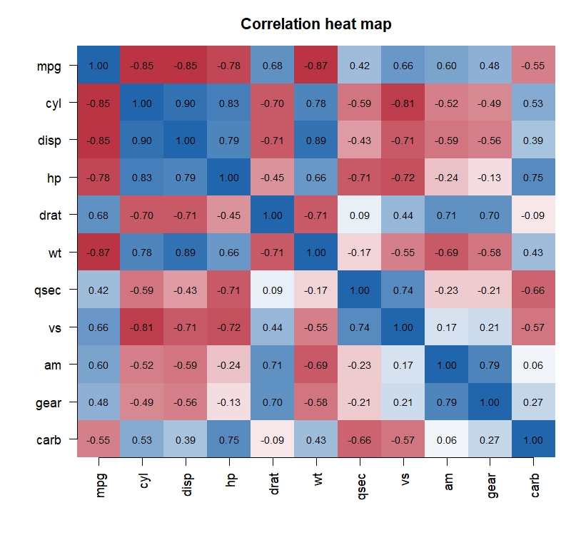

Correlation of each variable with mpg, strongest first:

| Variable | r with mpg |
|---|---|
| wt | −0.87 |
| cyl | −0.85 |
| disp | −0.85 |
| hp | −0.78 |
| drat | +0.68 |
| vs | +0.66 |
| am | +0.60 |
| carb | −0.55 |
| gear | +0.48 |
| qsec | +0.42 |

Strongly correlated predictor pairs (|r| above 0.7): cyl–disp 0.90, disp–wt 0.89, cyl–hp 0.83, cyl–vs −0.81, am–gear 0.79, disp–hp 0.79, cyl–wt 0.78, hp–carb 0.75, qsec–vs 0.74, hp–vs −0.72, drat–am 0.71, disp–drat −0.71, drat–wt −0.71, hp–qsec −0.71, disp–vs −0.71.

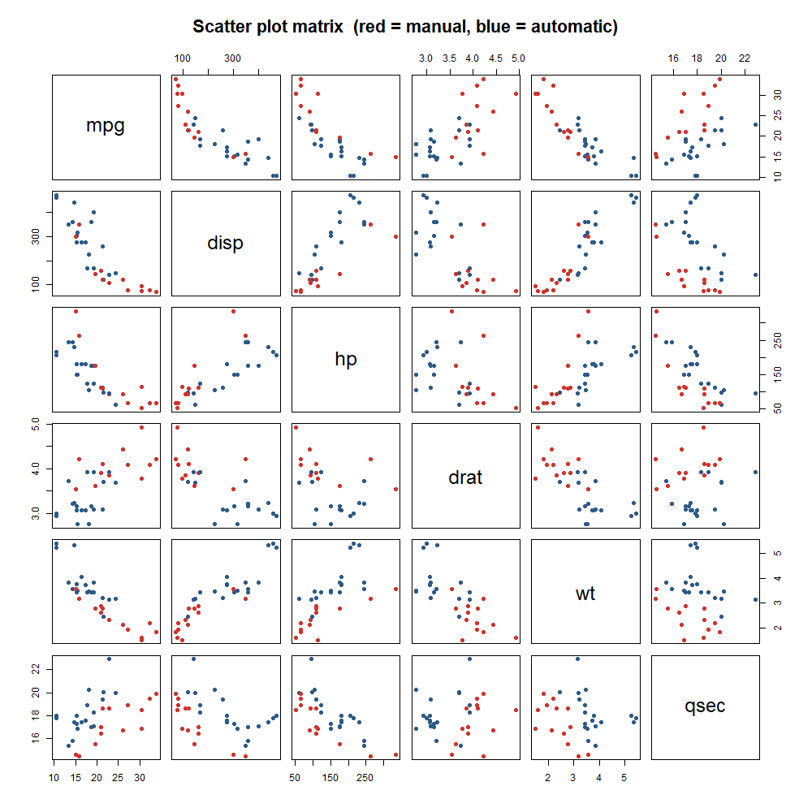

**Interpretation.**
- Four variables describe "how big is the engine and the car": wt, cyl, disp and hp. All four have correlations with mpg between −0.78 and −0.87, and they are correlated with each other at 0.66 to 0.90. They carry **one underlying signal, size**, not four separate signals.
- This is severe **multicollinearity**. A regression that includes all of them will have unstable coefficients and no individually significant predictors. The Task 1 regression showed exactly this: the full model had an R² of 0.87 but not one predictor with p below 0.05.
- The scatter plot matrix shows the mpg relationships are roughly linear with wt, and slightly curved with hp and disp (fuel economy falls quickly at first, then flattens). A log or reciprocal transform of mpg would straighten these.
- qsec is the only performance variable that is nearly independent of weight (r = −0.17), so it contributes information that wt does not.

### mpg by each categorical variable

| Group | Mean mpg | SD | n |
|---|---|---|---|
| 4 cylinders | 26.66 | 4.51 | 11 |
| 6 cylinders | 19.74 | 1.45 | 7 |
| 8 cylinders | 15.10 | 2.56 | 14 |
| Automatic | 17.15 | 3.83 | 19 |
| Manual | 24.39 | 6.17 | 13 |
| V engine | 16.62 | 3.86 | 18 |
| Straight engine | 24.56 | 5.38 | 14 |
| 3 gears | 16.11 | 3.37 | 15 |
| 4 gears | 24.53 | 5.28 | 12 |
| 5 gears | 21.38 | 6.66 | 5 |

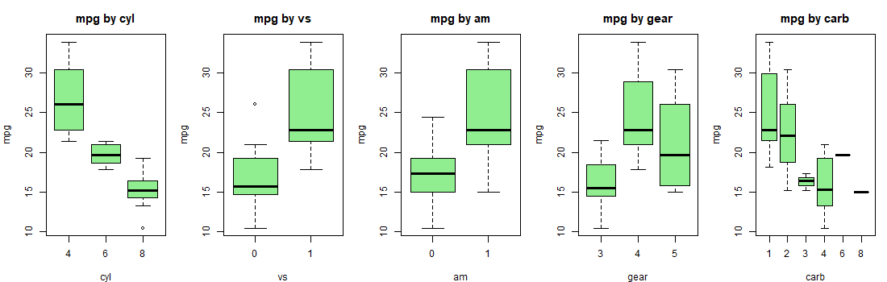

**Interpretation.**
- Cylinders give the cleanest separation: 4-cylinder cars average 11.6 mpg more than 8-cylinder cars, and the three groups barely overlap.
- Manual cars average 7.2 mpg more than automatics, with a t-test p-value of 0.001. On the surface this says "buy a manual".

### Is the transmission effect real? A confounding check

| Transmission | Mean weight (1000 lbs) | SD |
|---|---|---|
| Automatic | 3.77 | 0.78 |
| Manual | 2.41 | 0.62 |

| Test | p-value for transmission |
|---|---|
| t-test, mpg by am, no adjustment | 0.001 |
| Regression mpg ~ wt + am, adjusted for weight | 0.988 |

**Interpretation.** Manual cars in this sample are on average 1,360 lbs lighter than automatics. Once weight is held constant, the transmission effect disappears completely (p = 0.99). The two fitted lines in the figure sit almost on top of each other. The apparent manual advantage is a **weight effect in disguise**. This is the single most important finding of the cars EDA, and it is invisible in a one-variable-at-a-time analysis.

## 1.5 Three variables together

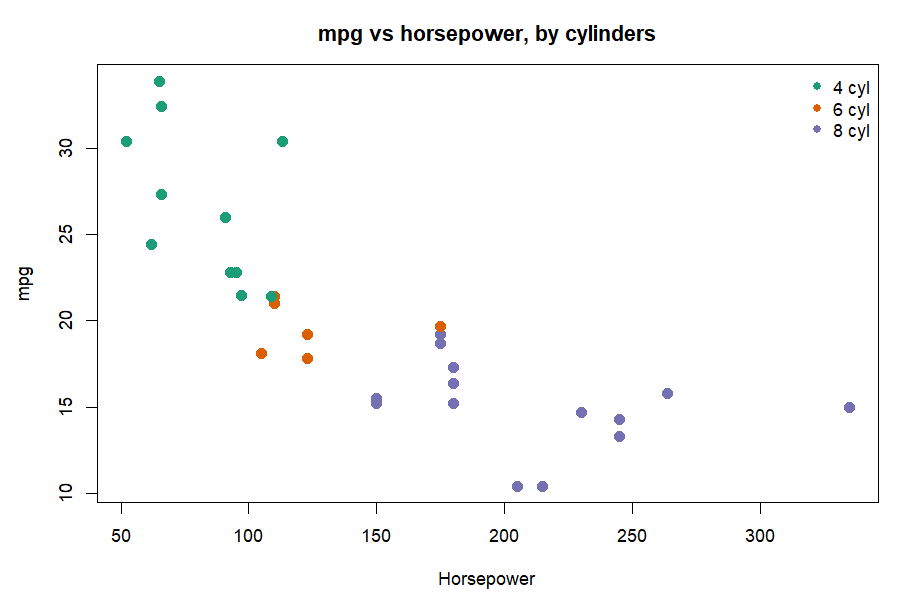

Mean mpg by cylinders and transmission:

| | Automatic | Manual |
|---|---|---|
| 4 cyl | 22.9 (n = 3) | 28.1 (n = 8) |
| 6 cyl | 19.1 (n = 4) | 20.6 (n = 3) |
| 8 cyl | 15.1 (n = 12) | 15.4 (n = 2) |

**Interpretation.**
- Within 8-cylinder cars, transmission makes no difference (15.1 vs 15.4). Within 4-cylinder cars there is still a gap, but only 3 automatics exist, so it is fragile.
- The sample is unbalanced: 8 of 13 manuals are 4-cylinder, 12 of 19 automatics are 8-cylinder. Transmission, cylinders and weight all point the same way, which is why they cannot be separated cleanly with 32 cars.
- In the hp plot, the three cylinder groups form three clusters along the hp axis with little overlap. hp and cyl are near-substitutes for each other.
- The five most economical cars are all light (1.5 to 2.2 thousand lbs) 4-cylinder manuals. The five least economical are all heavy 8-cylinder automatics above 3.5 thousand lbs and 200 hp.

## 1.6 Actionable insights from the cars data

1. **Weight is the lever.** Weight has the strongest link to fuel economy (r = −0.87) and, unlike transmission, its effect survives every adjustment. For a manufacturer, removing 1,000 lbs is worth roughly 4 to 5 mpg. For a buyer, the weight figure on the spec sheet is the best single predictor of running cost.
2. **Do not sell "manual = economical".** The 7 mpg manual advantage is entirely explained by manuals being lighter. A marketing or policy claim that manual transmissions save fuel is not supported once weight is controlled.
3. **Cylinder count is a good shortcut.** If only one categorical fact is known, cylinders predict mpg well: about 27, 20 and 15 mpg for 4, 6 and 8 cylinders. Fleet buyers can use this as a first screen.
4. **For modelling, pick one size variable, not four.** wt, disp, hp and cyl measure the same thing. Use wt (the strongest and most interpretable), and add qsec, which is the one performance variable independent of weight. This is exactly the model that stepwise selection chose in Task 1: mpg ~ wt + qsec + am.
5. **Consider a transformed outcome.** The mpg relationships with hp and disp are curved. Modelling log(mpg) or gallons per mile would improve linearity and reduce the influence of the four outlier cars.
6. **Treat the results as indicative, not definitive.** 32 cars from 1974, with only 3 automatic 4-cylinder cars and single cars at two carburettor levels, cannot support fine-grained claims. Any recommendation should be validated on a larger, modern dataset before it drives a decision.

---

# Part 2: Task 2, the crop yield dataset

## 2.1 What the data is

96 field plots from a fertilizer experiment. Each plot received one of three fertilizers and was planted at one of two densities. Yield is in bushels per acre.

| Variable | Levels | Type |
|---|---|---|
| fertilizer | 1, 2, 3 (labelled F1, F2, F3) | Factor |
| density | 1 = Low, 2 = High | Factor |
| block | 1, 2, 3, 4 | Factor |
| yield | continuous | Outcome |

## 2.2 Data quality

- 96 rows, 4 columns, **no missing values**, **no duplicate rows**.
- All three design variables are stored as integers and must be converted to factors, otherwise R would treat "fertilizer 3" as three times "fertilizer 1".
- **The design is perfectly balanced** for the two factors of interest: every fertilizer × density cell has exactly 16 plots. This is the ideal situation for ANOVA, because the sums of squares do not depend on the order variables enter the model.

| | Low | High |
|---|---|---|
| F1 | 16 | 16 |
| F2 | 16 | 16 |
| F3 | 16 | 16 |

- **A design flaw:** block is completely confounded with density.

| Block | Low | High |
|---|---|---|
| 1 | 24 | 0 |
| 2 | 0 | 24 |
| 3 | 24 | 0 |
| 4 | 0 | 24 |

Blocks 1 and 3 were planted only at low density, blocks 2 and 4 only at high density. Any difference between low and high density could equally be a difference between those pairs of blocks. The data cannot tell the two apart.

**Interpretation.** The dataset is clean and balanced for fertilizer and density, but block cannot be used as an independent control variable. This matters for how the density result is read (see 2.6).

## 2.3 One variable at a time: yield

| Statistic | Value |
|---|---|
| n | 96 |
| Mean | 177.02 |
| SD | 0.66 |
| Min | 175.36 |
| Q1 | 176.47 |
| Median | 177.06 |
| Q3 | 177.40 |
| Max | 179.06 |
| Range | 3.70 |
| Skew | 0.11 |
| CV | 0.38 % |
| Shapiro-Wilk p | 0.613 |
| IQR outliers | 1 (row 80, F3 High, 179.06) |

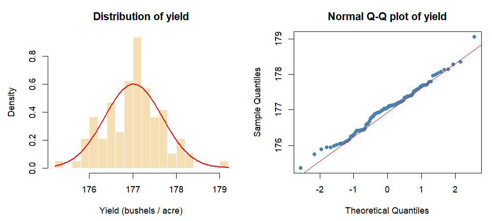

**Interpretation.**
- Yield is **remarkably tight**. The whole experiment spans 3.7 bushels per acre, and the standard deviation is 0.38 % of the mean. Whatever the treatments do, they do it within a narrow band.
- The distribution is **symmetric and normal** (skew 0.11, Shapiro-Wilk p = 0.61, Q-Q points on the line). ANOVA's normality assumption is comfortably met even before fitting a model.
- The single outlier (179.06) is the highest yield in the data. It belongs to the best treatment cell (F3, High), so it is consistent with the pattern rather than contradicting it. It is kept.
- Each factor level is equally represented: 32 plots per fertilizer, 48 per density, 24 per block.

## 2.4 Two variables at a time

### Yield by each factor

| Group | Mean | SD | Min | Max | n |
|---|---|---|---|---|---|
| F1 | 176.76 | 0.69 | 175.36 | 178.36 | 32 |
| F2 | 176.93 | 0.57 | 175.75 | 178.14 | 32 |
| F3 | 177.36 | 0.60 | 176.30 | 179.06 | 32 |
| Low density | 176.78 | 0.61 | 175.36 | 178.14 | 48 |
| High density | 177.25 | 0.64 | 175.88 | 179.06 | 48 |
| Block 1 | 176.86 | 0.63 | | | 24 |
| Block 2 | 177.32 | 0.65 | | | 24 |
| Block 3 | 176.71 | 0.59 | | | 24 |
| Block 4 | 177.18 | 0.65 | | | 24 |

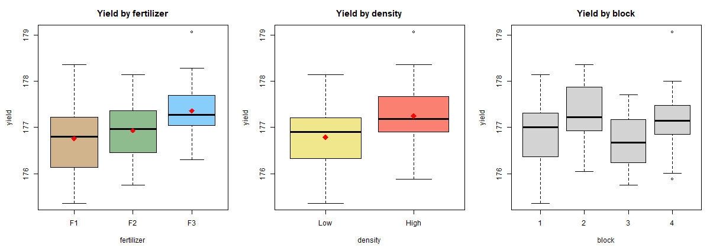

### Effect sizes

| Comparison | Difference (bushels) | Percent | In SD units |
|---|---|---|---|
| F3 vs F1 | +0.60 | +0.34 % | 0.90 |
| F3 vs F2 | +0.42 | +0.24 % | 0.64 |
| F2 vs F1 | +0.18 | +0.10 % | 0.27 |
| High vs Low density | +0.46 | +0.26 % | 0.70 |

**Interpretation.**
- **Fertilizer 3 is the best** and the ordering is F3 above F2 above F1. The F3 advantage over F1 is 0.9 standard deviations, a large effect in statistical terms even though it is only 0.34 % of the mean in agricultural terms.
- **F1 and F2 are practically tied.** Their means differ by 0.18 bushels, about a quarter of a standard deviation, and their box plots overlap almost entirely. The Task 2 Tukey test confirmed this pair is not significantly different (p = 0.45).
- **High density beats low density** by 0.46 bushels, 0.7 standard deviations.
- Blocks 2 and 4 look higher than blocks 1 and 3, but blocks 2 and 4 are exactly the high-density blocks. This is the confounding from 2.2 showing up in the numbers: the "block effect" and the "density effect" are the same 0.46 bushels seen twice.
- Spread is similar in every group (SD 0.57 to 0.69). The treatments shift the mean without changing the variability, which supports the equal-variance assumption.

## 2.5 Three variables together: fertilizer × density

Cell means (bushels per acre):

| | Low | High | Density gain |
|---|---|---|---|
| F1 | 176.44 | 177.07 | +0.64 |
| F2 | 176.78 | 177.09 | +0.31 |
| F3 | 177.14 | 177.58 | +0.44 |

Cell standard deviations range from 0.51 to 0.64 (Bartlett test p = 0.96).

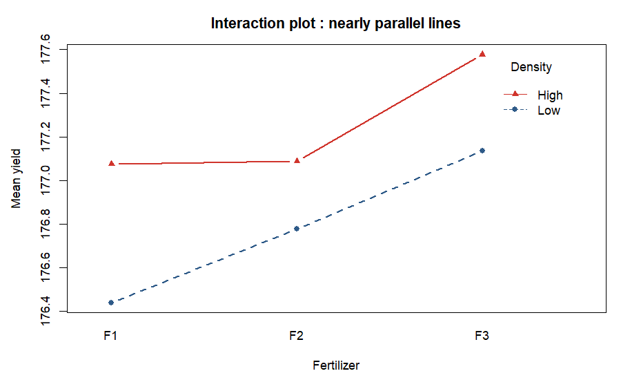

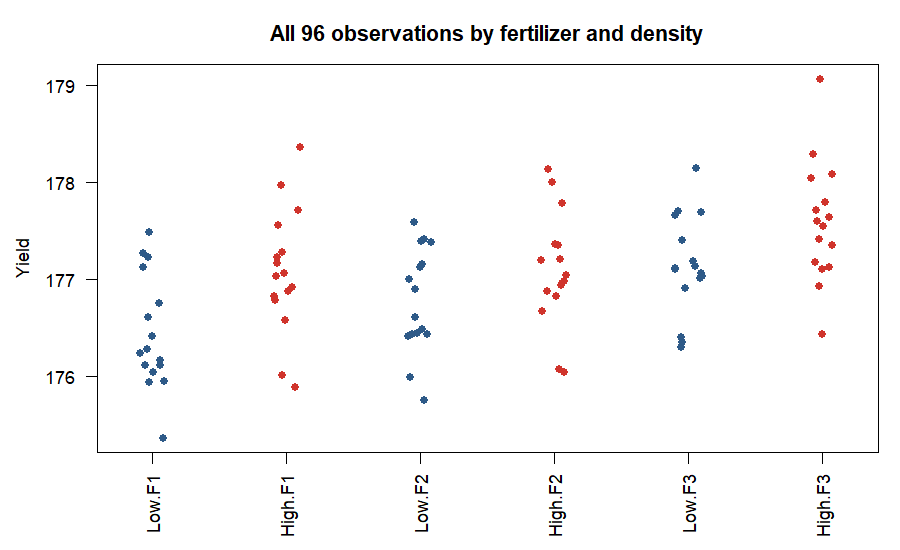

Ranking of the six combinations:

| Rank | Fertilizer | Density | Mean yield |
|---|---|---|---|
| 1 | F3 | High | 177.58 |
| 2 | F3 | Low | 177.14 |
| 3 | F2 | High | 177.09 |
| 4 | F1 | High | 177.07 |
| 5 | F2 | Low | 176.78 |
| 6 | F1 | Low | 176.44 |

Gap between best and worst: 1.14 bushels per acre, 0.65 %.

**Interpretation.**
- The two lines in the interaction plot are close to parallel and the density gain is positive for every fertilizer (0.31 to 0.64). There is **no meaningful interaction**: switching to high density helps regardless of fertilizer, and F3 is best at both densities. The Task 2 ANOVA gave the interaction a p-value of 0.53.
- Because the effects are additive, the best combination is simply the best fertilizer plus the best density: **F3 at high density**, at 177.58 bushels per acre.
- Notably, **F3 at low density (177.14) still beats F1 and F2 at high density (177.07 and 177.09)**. Fertilizer choice is worth slightly more than density choice.
- The strip chart shows how much the cells overlap. Individual plots from the worst cell can outperform individual plots from the best cell. The treatment effects are reliable on average, not guaranteed plot by plot.
- Equal cell variances (p = 0.96) mean the ANOVA F tests in Task 2 are trustworthy.

## 2.6 Actionable insights from the crop data

1. **Adopt fertilizer 3.** It delivers the highest yield at both densities, beats F1 by 0.60 bushels per acre and F2 by 0.42, and both differences are statistically significant. This is the clearest decision in the data.
2. **If F3 is unavailable or costly, F1 and F2 are interchangeable.** They are statistically tied, so choose between them on price, availability or environmental grounds, not on yield.
3. **Plant at high density, but treat the size of the gain with caution.** High density adds about 0.46 bushels per acre on average. However, density was confounded with block: all high-density plots were in blocks 2 and 4. If those two fields happen to be more fertile, part or all of the "density" gain belongs to the field, not the planting. The direction is plausible, but the magnitude is uncertain.
4. **Combine both: F3 at high density.** Expected yield 177.58 versus 176.44 for the worst combination, a gain of 1.14 bushels per acre (0.65 %). Because there is no interaction, the two decisions can be made independently.
5. **Weigh the gain against cost before rolling out.** A 0.34 % to 0.65 % yield increase is statistically real but agriculturally small. On a 100-acre farm it is roughly 60 to 114 extra bushels. The switch pays off only if the extra cost of F3 and of denser planting (seed, labour, fertilizer volume) is below the value of those bushels. The data supports a cost-benefit calculation, not an automatic switch.
6. **Low risk of variability.** Every treatment has a similar spread (SD about 0.6). F3 does not make yields less predictable, so there is no downside in consistency.
7. **Fix the design in the next trial.** Randomise density within each block so that every block contains both densities. Then block can be used as a true control variable, the density effect can be estimated cleanly, and the trial gains precision. The current data cannot separate density from block, and that should be stated in any report of the density result.
8. **Consider more extreme treatment levels.** All yields fall within 175 to 179. If the aim is to find a large improvement, future trials should test a wider range of densities and fertilizer rates. The current experiment shows differences of tenths of a bushel, which suggests the treatments were close to each other in strength.

---

# Summary of the two analyses

| | Cars (Task 1) | Crop yield (Task 2) |
|---|---|---|
| Data quality | Clean, 32 rows, small sample | Clean, 96 rows, balanced |
| Main driver of the outcome | Weight (r = −0.87) | Fertilizer type (0.9 SD effect) |
| Headline surprise | Manual-vs-automatic gap vanishes once weight is controlled | Block is confounded with density |
| Modelling caution | Severe multicollinearity among size variables | Cannot separate density from block |
| Best decision | Reduce weight; ignore transmission as a fuel lever | Fertilizer 3 at high density, after a cost check |
| Next step | Larger, modern sample; log-transform mpg | Randomise density within blocks; test wider treatment ranges |
