# Summative Assessment Solution (60 marks)

Two report-format tasks. Every R command below is in the two solution scripts in this folder, and every number quoted comes from actually running them:

| Task | Script | Full console output | Plots |
|---|---|---|---|
| Task 1 (25 marks) | `Summative_Task1_Solution.R` | `Summative_Task1_Output.txt` | `plots/task1_*.png` |
| Task 2 (35 marks) | `Summative_Task2_Solution.R` | `Summative_Task2_Output.txt` | `plots/task2_*.png` |

**How to reproduce in RStudio:** open the script, set the working directory to the `Assessment_Solutions` folder (Session → Set Working Directory → To Source File Location), and run it. The assignment asks for **screenshots of the RStudio screen** pasted into the Word report, so take a screenshot after each step.

---

# Task 1 : Histogram function and linear regression (25 marks)

**Dataset:** `Task1.csv`, 32 cars with 11 numeric variables (the classic `mtcars` data). The outcome we model is `mpg` (miles per gallon).

## Step 1 : Load and inspect the data

```r
cars <- read.csv("../1. Formative and Summative Assessment/S-Assignment Task 1/Task1.csv")
dim(cars)        # 32 rows, 12 columns
str(cars)
colSums(is.na(cars))   # all zero : no missing values
```

Explanation: `str()` shows every column is numeric except `model` (the car name). There are no missing values, so no cleaning is needed.

## Part (a) : Histogram using a function with two parameters (10 marks)

### Explanation

The task asks for a *function* that takes values and plots a histogram using two parameters. The function below takes the numeric vector and the number of bins. Two optional arguments add a label and a colour. It also prints the count on top of each bar and marks the mean with a dashed red line.

### Program

```r
draw_histogram <- function(values, n_bins,
                           label  = "Value",
                           colour = "steelblue") {
  hist(values,
       breaks = n_bins,                 # parameter 2 : number of bars
       col    = colour,
       border = "white",
       main   = paste("Histogram of", label),
       xlab   = label,
       ylab   = "Number of cars",
       labels = TRUE)                   # count above each bar
  abline(v = mean(values), col = "red", lwd = 2, lty = 2)
  legend("topright", legend = paste("Mean =", round(mean(values), 2)),
         col = "red", lty = 2, lwd = 2, bty = "n")
}

# Call it with different values and parameters
draw_histogram(cars$mpg, n_bins = 8,  label = "Miles per gallon (mpg)", colour = "steelblue")
draw_histogram(cars$hp,  n_bins = 10, label = "Horsepower (hp)",        colour = "darkorange")
draw_histogram(cars$wt,  n_bins = 6,  label = "Weight (1000 lbs)",      colour = "seagreen")
```

### Output

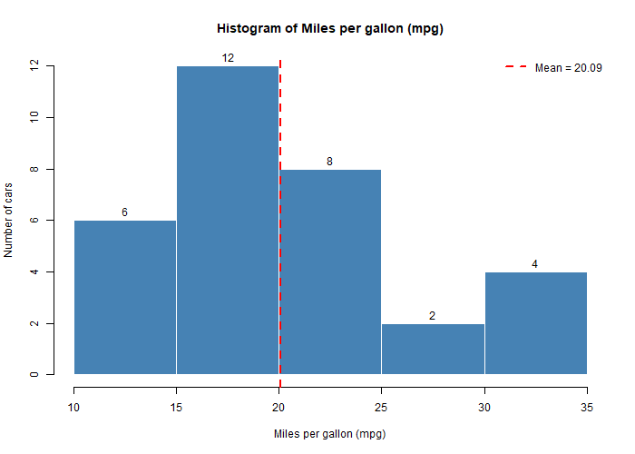
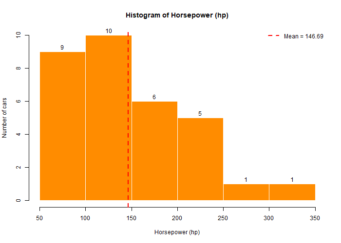
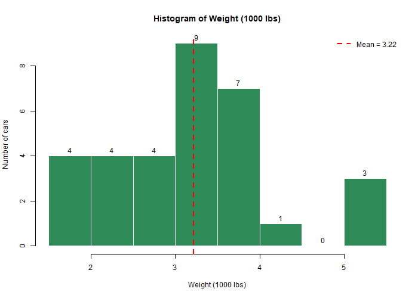

```
Summary of mpg :   Min 10.40  1st Qu 15.43  Median 19.20  Mean 20.09  3rd Qu 22.80  Max 33.90
Summary of hp  :   Min 52.0   1st Qu 96.5   Median 123.0  Mean 146.7  3rd Qu 180.0  Max 335.0
Summary of wt  :   Min 1.513  1st Qu 2.581  Median 3.325  Mean 3.217  3rd Qu 3.610  Max 5.424
```

### Interpretation

- **mpg** is slightly right-skewed: most cars do 15 to 23 mpg, with a few very economical cars above 30.
- **hp** is strongly right-skewed: a handful of cars above 250 hp pull the mean (147) above the median (123).
- **wt** is roughly symmetric around 3.2 (thousand lbs).

Marks note: the function has two required parameters (`values`, `n_bins`), the histograms are labelled and coloured, and it was called three times with different inputs.

## Part (b) : Linear regression with variable selection (15 marks)

### Step 2 : Initial data analysis, numerical

```r
num_cars <- cars[, -1]                  # drop the text column
summary(num_cars)
sort(cor(num_cars)[, "mpg"], decreasing = TRUE)
```

Output (correlation with mpg):

```
  mpg   drat    vs     am   gear   qsec   carb     hp   disp    cyl     wt
1.000  0.681  0.664  0.600  0.480  0.419 -0.551 -0.776 -0.848 -0.852 -0.868
```

Interpretation: `wt`, `cyl`, `disp` and `hp` all have strong negative correlation with mpg. Heavier, bigger, more powerful cars burn more fuel. But the full correlation matrix also shows `wt`, `disp`, `cyl` and `hp` are strongly related to *each other* (0.78 to 0.90). This is **multicollinearity**, and it means we should not put all of them in one model.

### Step 3 : Initial data analysis, graphical

```r
pairs(num_cars[, c("mpg", "wt", "hp", "disp", "qsec")], pch = 16, col = "steelblue")
boxplot(mpg ~ cyl,  data = cars)
boxplot(mpg ~ am,   data = cars)
boxplot(mpg ~ gear, data = cars)
plot(cars$wt, cars$mpg); abline(lm(mpg ~ wt, data = cars), col = "red")
```

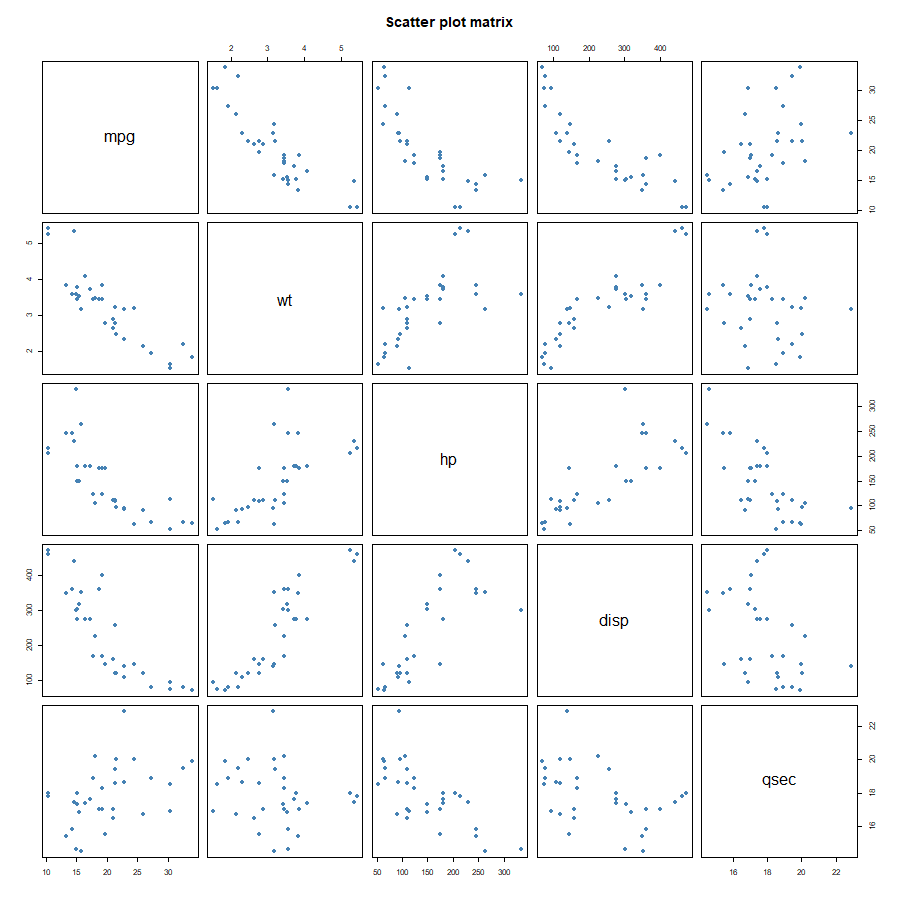
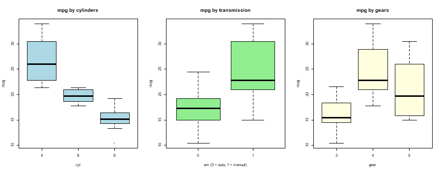
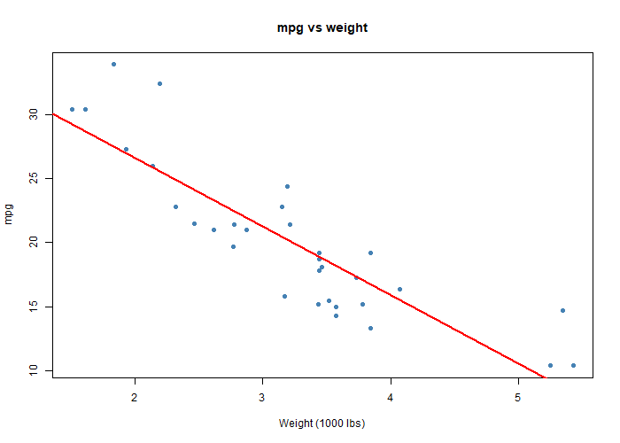

Interpretation: the scatter-plot matrix shows clear straight-line relationships between mpg and wt, hp and disp. The box plots show mpg drops as cylinders increase, and manual cars (am = 1) have higher mpg on average.

### Step 4 : Simple model as a starting point

```r
model_simple <- lm(mpg ~ wt, data = cars)
summary(model_simple)
```

```
Coefficients:
            Estimate Std. Error t value Pr(>|t|)
(Intercept)  37.2851     1.8776  19.858  < 2e-16 ***
wt           -5.3445     0.5591  -9.559 1.29e-10 ***
Multiple R-squared:  0.7528,	Adjusted R-squared:  0.7446
```

Interpretation: every extra 1000 lbs lowers mpg by 5.34. Weight alone explains 75 % of the variation in mpg.

### Step 5 : Full model with all predictors

```r
model_full <- lm(mpg ~ ., data = num_cars)
summary(model_full)
```

```
Multiple R-squared:  0.869,	Adjusted R-squared:  0.8066
(no single predictor has p < 0.05; wt is closest with p = 0.063)
```

Interpretation: R² is higher but *no* predictor is individually significant. That is the classic symptom of multicollinearity. The predictors overlap so much that the model cannot decide which one deserves the credit. Variable selection is needed.

### Step 6 : Variable selection (backward stepwise by AIC)

```r
model_step <- step(model_full, direction = "backward")
formula(model_step)
summary(model_step)
```

`step()` removes one variable at a time as long as AIC falls. The order of removal was cyl, vs, carb, gear, drat, disp, hp. AIC dropped from 70.9 to 61.3. The final model:

```
mpg ~ wt + qsec + am

            Estimate Std. Error t value Pr(>|t|)
(Intercept)   9.6178     6.9596   1.382 0.177915
wt           -3.9165     0.7112  -5.507 6.95e-06 ***
qsec          1.2259     0.2887   4.247 0.000216 ***
am            2.9358     1.4109   2.081 0.046716 *
Residual standard error: 2.459 on 28 degrees of freedom
Multiple R-squared:  0.8497,	Adjusted R-squared:  0.8336
F-statistic: 52.75 on 3 and 28 DF,  p-value: 1.21e-11
```

### Step 7 : Compare candidate models

| Model | Adjusted R² | AIC |
|---|---|---|
| mpg ~ wt | 0.745 | 166.0 |
| mpg ~ wt + hp | 0.815 | 156.7 |
| mpg ~ wt + am | 0.736 | 168.0 |
| **mpg ~ wt + qsec + am (stepwise)** | **0.834** | **154.1** |
| full model (10 predictors) | 0.807 | 163.7 |

The stepwise model has the highest adjusted R² and the lowest AIC. A formal F test comparing it with the full model gives p = 0.86, so the seven dropped variables added nothing.

### Step 8 : Interpret the best model

```r
coef(model_step); confint(model_step)
```

- **wt = −3.92**: each extra 1000 lbs costs about 3.9 mpg, holding qsec and am fixed.
- **qsec = +1.23**: each extra second of quarter-mile time adds about 1.2 mpg. Slower cars are less powerful and more economical.
- **am = +2.94**: a manual car gets about 2.9 mpg more than an automatic of the same weight and speed.
- All three 95 % confidence intervals exclude zero, so all three effects are significant.
- Adjusted R² = 0.834: the model explains about 83 % of the variation in mpg.

### Step 9 : Check the model is valid

```r
par(mfrow = c(2, 2)); plot(model_step)
shapiro.test(residuals(model_step))      # W = 0.941, p = 0.080
cor(cars[, c("wt", "qsec", "am")])
```


- Residuals vs Fitted: no curve or funnel, so linearity and constant variance hold.
- Q-Q plot: points close to the line. Shapiro-Wilk p = 0.08 > 0.05, so residuals are approximately normal.
- The three chosen predictors have modest correlations with each other (the largest is wt vs am at −0.69), so multicollinearity is no longer a problem.

### Step 10 : Prediction

```r
new_cars <- data.frame(wt = c(2.5, 3.5), qsec = c(18, 16), am = c(1, 0))
predict(model_step, newdata = new_cars)
#  24.83   15.52
```

A light manual car is predicted at 24.8 mpg; a heavier, faster automatic at 15.5 mpg.

### Conclusion for Task 1

The best linear regression model for fuel economy is **mpg = 9.62 − 3.92·wt + 1.23·qsec + 2.94·am**. It was chosen by backward stepwise selection, has the lowest AIC of all candidates, explains 83 % of the variation, and passes the residual checks.

---

# Task 2 : One-way and two-way ANOVA on crop yield (35 marks)

**Dataset:** `crop_data.csv`, 96 observations.

| Variable | Type | Values |
|---|---|---|
| fertilizer | categorical | 1, 2, 3 |
| density | categorical | 1 = low, 2 = high |
| block | categorical | 1 to 4 |
| yield | continuous | bushels per acre |

## Step 1 : Data cleaning

```r
crop <- read.csv("../1. Formative and Summative Assessment/S-Assignment Task 2/crop_data.csv")
colSums(is.na(crop))          # all zero
crop$fertilizer <- factor(crop$fertilizer, labels = c("F1", "F2", "F3"))
crop$density    <- factor(crop$density,    labels = c("Low", "High"))
crop$block      <- factor(crop$block)
```

**Missing values:** none.

**Factor conversion:** the three categorical columns are stored as numbers. If left numeric, R would treat "fertilizer 3" as three times "fertilizer 1", which is meaningless. `factor()` tells R they are categories.

**Outliers** (1.5 × IQR rule):

```r
Q1 <- quantile(crop$yield, 0.25); Q3 <- quantile(crop$yield, 0.75)
fence <- c(Q1 - 1.5 * (Q3 - Q1), Q3 + 1.5 * (Q3 - Q1))   # 175.07 to 178.79
```

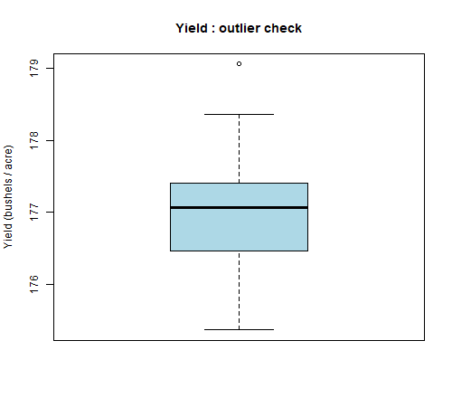

One value (179.06) lies just above the upper fence. It is a mild outlier and a plausible yield, not a data-entry error. Removing it would unbalance the design, so it is kept. Step 6 confirms it does not harm the assumptions.

**Balance check:**

```
     Low High
F1    16   16
F2    16   16
F3    16   16
```

Every fertilizer × density cell has 16 observations. The design is balanced, which makes the ANOVA sums of squares unambiguous.

## Step 2 : Exploratory data analysis

```r
summary(crop$yield); sd(crop$yield)
aggregate(yield ~ fertilizer, data = crop, FUN = mean)
aggregate(yield ~ density,    data = crop, FUN = mean)
aggregate(yield ~ fertilizer + density, data = crop, FUN = mean)
```

| Group | Mean yield | SD | n |
|---|---|---|---|
| Fertilizer 1 | 176.76 | 0.69 | 32 |
| Fertilizer 2 | 176.93 | 0.57 | 32 |
| Fertilizer 3 | 177.36 | 0.60 | 32 |
| Density Low | 176.78 | 0.61 | 48 |
| Density High | 177.25 | 0.64 | 48 |

Cell means (fertilizer × density):

| | Low | High |
|---|---|---|
| F1 | 176.44 | 177.07 |
| F2 | 176.78 | 177.09 |
| F3 | 177.14 | 177.58 |

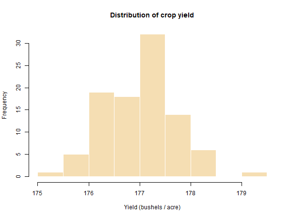
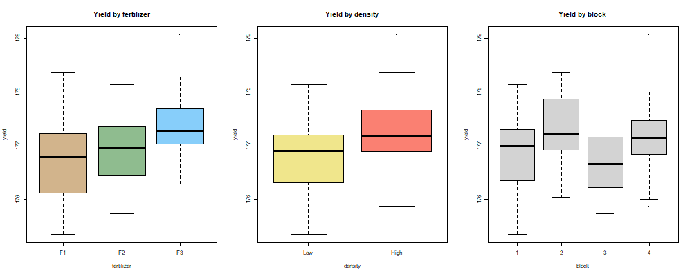
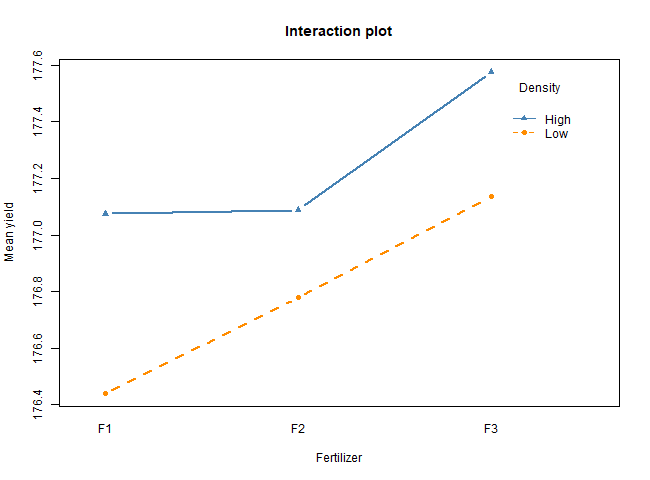

Interpretation: yield is roughly bell-shaped around 177. Fertilizer 3 has the highest mean, high density beats low density, and block shows no visible pattern. In the interaction plot the two density lines are almost parallel, which already suggests there is no interaction.

## Step 3 : One-way ANOVA

**Hypotheses**

- H0: mean yield is the same for all three fertilizers (μ₁ = μ₂ = μ₃)
- H1: at least one fertilizer has a different mean yield

**Assumptions** (checked in Step 6): independent observations, normally distributed residuals, equal variances across groups.

```r
one_way <- aov(yield ~ fertilizer, data = crop)
summary(one_way)
```

```
            Df Sum Sq Mean Sq F value Pr(>F)
fertilizer   2   6.07  3.0340   7.863  7e-04 ***
Residuals   93  35.89  0.3859
```

**Interpretation:** F(2, 93) = 7.86, p = 0.0007 < 0.05. Reject H0. Fertilizer type has a statistically significant effect on crop yield.

## Step 4 : Two-way ANOVA

**Hypotheses**

- H0(a): fertilizer has no effect on yield
- H0(b): planting density has no effect on yield
- H0(c): there is no interaction (the effect of fertilizer is the same at both densities)

### 4a. Additive model

```r
two_way_add <- aov(yield ~ fertilizer + density, data = crop)
summary(two_way_add)
```

```
            Df Sum Sq Mean Sq F value   Pr(>F)
fertilizer   2  6.068   3.034   9.073 0.000253 ***
density      1  5.122   5.122  15.316 0.000174 ***
Residuals   92 30.765   0.334
```

### 4b. Interaction model

```r
two_way_int <- aov(yield ~ fertilizer * density, data = crop)
summary(two_way_int)
```

```
                   Df Sum Sq Mean Sq F value   Pr(>F)
fertilizer          2  6.068   3.034   9.001 0.000273 ***
density             1  5.122   5.122  15.195 0.000186 ***
fertilizer:density  2  0.428   0.214   0.635 0.532500
Residuals          90 30.337   0.337
```

**Interpretation:** both main effects are highly significant (p < 0.001). The interaction term has p = 0.53, so H0(c) is **not** rejected: the effect of fertilizer does not depend on density. The simpler additive model is preferred.

### 4c. Adding block as a control

```r
two_way_block <- aov(yield ~ fertilizer + density + block, data = crop)
summary(two_way_block)     # block p = 0.49 : not significant
```

### 4d. Which model is best?

| Model | AIC |
|---|---|
| one-way: fertilizer | 185.97 |
| **two-way additive: fertilizer + density** | **173.19** |
| two-way interaction: fertilizer * density | 175.85 |
| blocked: fertilizer + density + block | 175.66 |

Adding density to the one-way model cuts AIC by almost 13, a large improvement. Adding the interaction or block makes AIC worse. The **additive two-way model** is chosen.

## Step 5 : Post-hoc test (which fertilizers differ?)

```r
TukeyHSD(two_way_add)
```

```
$fertilizer
           diff     lwr    upr    p adj
F2-F1   0.176  -0.168  0.521  0.4453
F3-F1   0.599   0.255  0.944  0.0002 ***
F3-F2   0.423   0.079  0.767  0.0119 *

$density
            diff    lwr    upr    p adj
High-Low   0.462  0.228  0.696  0.0002 ***
```

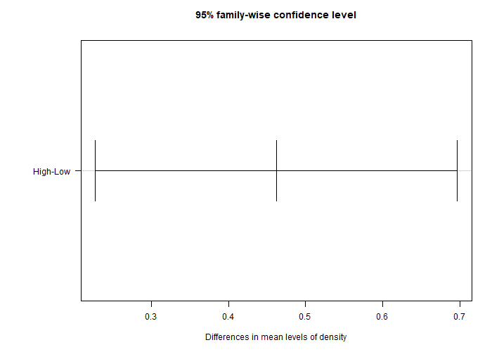

**Interpretation:** Fertilizer 3 gives significantly higher yield than both fertilizer 1 (+0.60, p = 0.0002) and fertilizer 2 (+0.42, p = 0.012). Fertilizers 1 and 2 are not significantly different (p = 0.45). High density gives +0.46 over low density (p = 0.0002).

## Step 6 : Validity of the model (assumption checks)

```r
shapiro.test(residuals(two_way_add))
bartlett.test(yield ~ fertilizer, data = crop)
bartlett.test(yield ~ density,    data = crop)
bartlett.test(yield ~ interaction(fertilizer, density), data = crop)
par(mfrow = c(1, 2)); plot(two_way_add, which = 1:2)
```

| Check | Test | Result | Verdict |
|---|---|---|---|
| Normality of residuals | Shapiro-Wilk | W = 0.985, p = 0.358 | Normal (p > 0.05) |
| Equal variance by fertilizer | Bartlett | p = 0.588 | Equal |
| Equal variance by density | Bartlett | p = 0.688 | Equal |
| Equal variance across all 6 cells | Bartlett | p = 0.963 | Equal |
| Independence | Design | one measurement per plot, randomised | Satisfied |

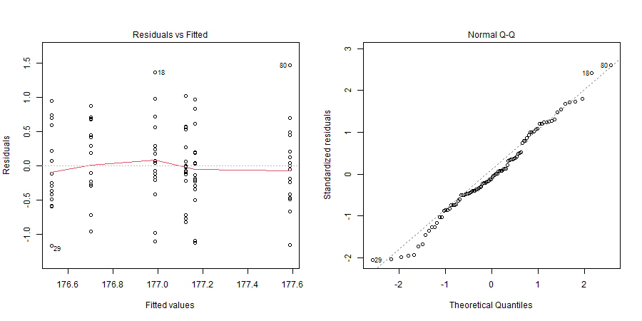

The Residuals vs Fitted plot shows a random cloud with no funnel, and the Q-Q plot points sit on the line. All assumptions hold, so the F tests and p-values are valid. The single mild outlier kept in Step 1 has not affected normality.

## Step 7 : Summary of findings

1. **Fertilizer matters.** One-way ANOVA: F(2, 93) = 7.86, p = 0.0007. Mean yields are 176.76 (F1), 176.93 (F2) and 177.36 (F3) bushels per acre.
2. **Density matters.** Two-way ANOVA: F(1, 92) = 15.32, p = 0.0002. High density yields 177.25 versus 176.78 for low density.
3. **No interaction.** p = 0.53. The best fertilizer is the best at both densities, so the two decisions can be made independently.
4. **Fertilizer 3 is the winner.** Tukey HSD shows it beats F1 and F2; F1 and F2 are statistically tied.
5. **Block has no effect** (p = 0.49), so field position did not bias the results.
6. **The model is valid.** Residuals are normal and variances are equal, confirmed by Shapiro-Wilk, Bartlett and the diagnostic plots.
7. **Recommendation:** plant at **high density** with **fertilizer 3**. That cell had the highest observed mean yield (177.58 bushels per acre).

---

## Report checklist

| Requirement | Where it is covered |
|---|---|
| Task 1(a) histogram via a function with two parameters, labelled and coloured | Part (a) |
| Task 1(b) numerical and graphical exploration | Steps 2 and 3 |
| Task 1(b) variable selection and best model | Steps 5 to 7 |
| Task 2 data cleaning (missing values, outliers) | Step 1 |
| Task 2 exploratory analysis | Step 2 |
| One-way and two-way hypotheses and assumptions | Steps 3, 4 and 6 |
| Interpretation of results | After every output |
| Validity of the model and summary | Steps 6 and 7 |
| Program and output pasted in the Word file | Copy from the two `.R` files and `.txt` outputs, plus RStudio screenshots |
