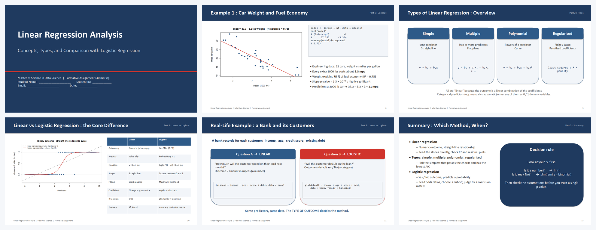
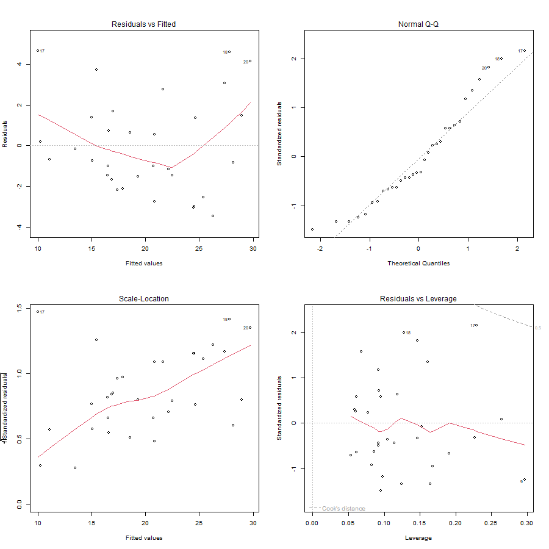
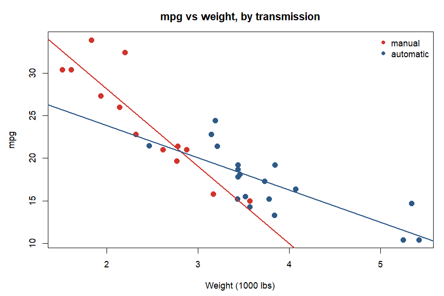

<p align="center">
  
</p>

<h1 align="center">DataMining_Airtics</h1>

<p align="center">
  <b>Teaching materials, worked assessments and exploratory analysis for the <i>Data Mining Using R</i> course</b><br>
  Master of Science in Data Science
</p>

<p align="center">
  <a href="https://www.r-project.org/"></a>
  
  
  <a href="LICENSE"></a>
  
  
</p>

<p align="center">
  <a href="#-whats-inside">What's inside</a> •
  <a href="#-quick-start">Quick start</a> •
  <a href="#-learning-path">Learning path</a> •
  <a href="#-assessments">Assessments</a> •
  <a href="#-exploratory-data-analysis">EDA</a> •
  <a href="#%EF%B8%8F-repository-structure">Structure</a> •
  <a href="https://mlnjsh.github.io/DataMining_Airtics/">Course site</a>
</p>

---

## 📦 What's inside

| | Component | Description |
|:-:|---|---|
| 📖 | **Lesson plan** | Six-session course outline: `Data_Mining_Using_R_6_Session_Lesson_Plan.md` |
| 🖥️ | **Interactive slides** | `BasicsOfR_Interactive_Slides.html`, an in-browser R primer ([open it](https://mlnjsh.github.io/DataMining_Airtics/BasicsOfR_Interactive_Slides.html)) |
| 📊 | **Lecture deck** | `datamining-lect1.pptx`, introduction to data mining |
| 🧪 | **7 R scripts** | Beginner-friendly, heavily commented, base R only: from arithmetic to logistic regression |
| 📝 | **Assessments** | The formative and summative briefs plus their datasets |
| ✅ | **Worked solutions** | Step-by-step solutions in R, Markdown and Word, with every output reproduced |
| 🎤 | **Presentation** | Ready-to-submit 16-slide deck with speaker notes for the formative assignment |
| 🔍 | **EDA report** | Detailed exploratory analysis of both assignment datasets with actionable insights |

## 🚀 Quick start

```bash
git clone https://github.com/mlnjsh/DataMining_Airtics.git
cd DataMining_Airtics/R_Scripts
Rscript 01_Hypothesis_Testing_One_Sample.R
```

Or open any script in RStudio and run it line by line. **No packages need to be installed**: every script uses base R only. R 4.2 or later is recommended.

> **Note on paths.** The two summative solution scripts and the EDA script read the CSV datasets with relative paths. Run them with the working directory set to their own folder (in RStudio: *Session → Set Working Directory → To Source File Location*).

## 🎓 Learning path

The scripts build on each other. Start at 00 and work down.

| # | Script | You will learn | Dataset |
|:-:|---|---|---|
| 00 | [`00_R_Basics_Complete_Reference.R`](R_Scripts/00_R_Basics_Complete_Reference.R) | Arithmetic, data structures, loops, functions, packages, files, descriptive statistics, distributions, plots | `mtcars`, `iris` |
| 01 | [`01_Hypothesis_Testing_One_Sample.R`](R_Scripts/01_Hypothesis_Testing_One_Sample.R) | Z test, t test and proportion test for a single sample, by hand and with built-ins | hand-typed |
| 02 | [`02_Hypothesis_Testing_Two_Sample.R`](R_Scripts/02_Hypothesis_Testing_Two_Sample.R) | F test, two-sample Z and t tests, Welch, paired t, two-proportion test | hand-typed |
| 03 | [`03_One_Way_ANOVA.R`](R_Scripts/03_One_Way_ANOVA.R) | Comparing three or more means, Tukey HSD, assumption checks, Kruskal-Wallis | `PlantGrowth` |
| 04 | [`04_Two_Way_ANOVA.R`](R_Scripts/04_Two_Way_ANOVA.R) | Two factors, interaction effects, interaction plots | `ToothGrowth` |
| 05 | [`05_Linear_Regression.R`](R_Scripts/05_Linear_Regression.R) | Simple and multiple regression, model comparison, diagnostics, prediction intervals | `mtcars` |
| 06 | [`06_Logistic_Regression.R`](R_Scripts/06_Logistic_Regression.R) | Binary outcomes, odds ratios, train/test split, confusion matrix | Pima Indians Diabetes (downloaded) |

Every script follows the same pattern: state the hypotheses in comments, show the formula by hand, then run the built-in function, then print a plain-English **REJECT** or **DO NOT reject** decision. Each file ends with a summary table of the R functions used. See [`R_Scripts/README.md`](R_Scripts/README.md) for details.

## 📝 Assessments

The briefs and datasets are in [`1. Formative and Summative Assessment/`](1.%20Formative%20and%20Summative%20Assessment). Worked solutions are in [`Assessment_Solutions/`](Assessment_Solutions).

### Formative (40 marks): presentation on linear regression

<p align="center">
  <a href="Assessment_Solutions/presentation/Formative_Assessment_Presentation.pptx">
    
  </a>
</p>

A 16-slide deck (13 content slides plus cover, references and thank-you) with **speaker notes on every slide**, covering the concept of linear regression, its types with examples from six professions, and the contrast with logistic regression. All R output on the slides is real.

- 📽️ [`Formative_Assessment_Presentation.pptx`](Assessment_Solutions/presentation/Formative_Assessment_Presentation.pptx)
- 📄 [`Formative_Assessment_Solution.md`](Assessment_Solutions/Formative_Assessment_Solution.md) / [`.docx`](Assessment_Solutions/Formative_Assessment_Solution.docx): slide-by-slide plan and notes
- 🐍 [`build_presentation.py`](Assessment_Solutions/presentation/build_presentation.py): regenerates the deck with python-pptx

### Summative (60 marks): R report

| Task | Marks | What is done | Key result |
|:-:|:-:|---|---|
| 1 | 25 | Histogram function with two parameters; regression with backward stepwise selection on the cars data | Best model `mpg ~ wt + qsec + am`, adjusted R² 0.83, lowest AIC |
| 2 | 35 | Data cleaning, EDA, one-way and two-way ANOVA on the crop yield data, Tukey HSD, assumption checks | Fertilizer 3 at high density; no interaction; all assumptions hold |

<p align="center">
  
  
</p>

- 📄 [`Summative_Assessment_Solution.md`](Assessment_Solutions/Summative_Assessment_Solution.md) / [`.docx`](Assessment_Solutions/Summative_Assessment_Solution.docx): the full report
- 🧪 [`Summative_Task1_Solution.R`](Assessment_Solutions/Summative_Task1_Solution.R), [`Summative_Task2_Solution.R`](Assessment_Solutions/Summative_Task2_Solution.R): the programs
- 🖨️ `Summative_Task1_Output.txt`, `Summative_Task2_Output.txt`: console output, and `plots/` with all 13 figures

## 🔍 Exploratory Data Analysis

[`Assessment_Solutions/EDA/`](Assessment_Solutions/EDA) contains a four-layer EDA of both datasets (data quality, univariate, bivariate, multivariate) with interpretation after every step and a list of actionable insights for each.

<p align="center">
  
  
</p>

Two findings that only appear when variables are looked at together:

- 🚗 **Cars.** Manual cars average 7 mpg more than automatics (p = 0.001), but manuals are 1,360 lbs lighter. After controlling for weight the transmission effect disappears (p = 0.99). The manual advantage is a weight effect in disguise.
- 🌾 **Crops.** Block is completely confounded with planting density: blocks 1 and 3 were planted only at low density, blocks 2 and 4 only at high. The density effect cannot be separated from a field effect, and the next trial should randomise density within blocks.

- 📄 [`EDA_Report.md`](Assessment_Solutions/EDA/EDA_Report.md) / [`.docx`](Assessment_Solutions/EDA/EDA_Report.docx)
- 🧪 [`EDA_Task1_Task2.R`](Assessment_Solutions/EDA/EDA_Task1_Task2.R) and `EDA_Output.txt`, `plots/`

## 🗂️ Repository structure

```
DataMining_Airtics/
├── 📖 Data_Mining_Using_R_6_Session_Lesson_Plan.md
├── 🖥️ BasicsOfR_Interactive_Slides.html
├── 📊 datamining-lect1.pptx
│
├── 📁 1. Formative and Summative Assessment/
│   ├── Formative Assessment.docx
│   ├── Summative Assessment.docx
│   ├── S-Assignment Task 1/Task1.csv          (32 cars)
│   └── S-Assignment Task 2/crop_data.csv      (96 field plots)
│
├── 📁 R_Scripts/
│   ├── 00_R_Basics_Complete_Reference.R
│   ├── 01_Hypothesis_Testing_One_Sample.R
│   ├── 02_Hypothesis_Testing_Two_Sample.R
│   ├── 03_One_Way_ANOVA.R
│   ├── 04_Two_Way_ANOVA.R
│   ├── 05_Linear_Regression.R
│   └── 06_Logistic_Regression.R
│
├── 📁 Assessment_Solutions/
│   ├── Formative_Assessment_Solution.md  (+ .docx)
│   ├── Summative_Assessment_Solution.md  (+ .docx)
│   ├── Summative_Task1_Solution.R  →  Summative_Task1_Output.txt
│   ├── Summative_Task2_Solution.R  →  Summative_Task2_Output.txt
│   ├── plots/                              (13 figures)
│   ├── md_to_docx.py                       (Markdown → Word converter)
│   ├── presentation/
│   │   ├── Formative_Assessment_Presentation.pptx
│   │   ├── build_presentation.py
│   │   └── img/
│   └── EDA/
│       ├── EDA_Task1_Task2.R  →  EDA_Output.txt
│       ├── EDA_Report.md  (+ .docx)
│       └── plots/                          (12 figures)
│
├── 📁 docs/                                 (GitHub Pages site and images)
├── LICENSE
└── README.md
```

## 🛠️ Tooling

| Purpose | Tool |
|---|---|
| Analysis | R 4.2.3, base packages only |
| Presentation | Python 3 with `python-pptx` |
| Word export | Python 3 with `python-docx` (`Assessment_Solutions/md_to_docx.py`) |
| Figures | Base R graphics saved with `png()` |

Regenerate any derived file:

```bash
# Word versions of the reports
cd Assessment_Solutions
python md_to_docx.py Summative_Assessment_Solution.md
python md_to_docx.py EDA/EDA_Report.md EDA/EDA_Report.docx

# The presentation
cd presentation && python build_presentation.py
```

## 📚 References

- James, Witten, Hastie and Tibshirani (2021). *An Introduction to Statistical Learning with Applications in R*, 2nd ed. Springer.
- Field, Miles and Field (2012). *Discovering Statistics Using R*. Sage.
- R Core Team (2023). *R: A Language and Environment for Statistical Computing*. https://www.R-project.org/
- Henderson and Velleman (1981). Building multiple regression models interactively. *Biometrics* 37, 391–411. (source of the `mtcars` data)
- Smith et al. (1988). Using the ADAP learning algorithm to forecast the onset of diabetes mellitus. (source of the Pima Indians Diabetes data)

## 📄 Licence

Released under the [MIT Licence](LICENSE). The assessment briefs are course materials reproduced for educational use.

<p align="center"><sub>Maintained by <a href="https://github.com/mlnjsh">@mlnjsh</a> · Built with R and a little Python</sub></p>
